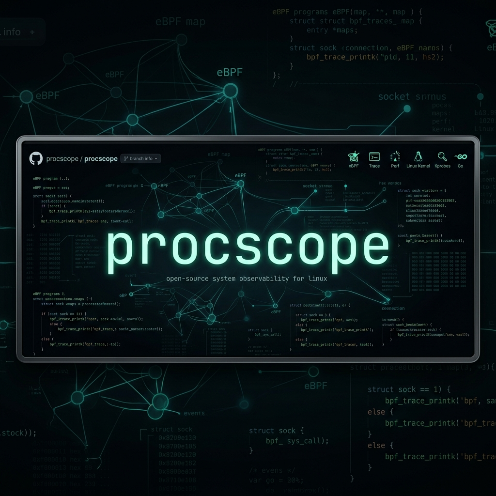

<p align="center">
  
</p>

# procscope

**Process-scoped runtime investigator for Linux.**

<p align="center">
  <a href="https://github.com/avelino/awesome-go"></a>
  
  
  
  
</p>

Launch a command under observation — or attach to an existing process — and see what it actually does at runtime: process lifecycle, file activity, network connections, privilege transitions, namespace changes, and more.

**Designed for:** security research, malware triage, reverse engineering support, incident response, and deep debugging.

**Not designed for:** EDR, SIEM, Kubernetes-first monitoring, policy enforcement, or whole-system tracing.

## Quick Start 

[](https://killercoda.com/mutasem04/scenario/procscope-scenario)
*(Note: Link your GitHub repo to Killercoda to activate this live interactive sandbox!)*

```bash
# Trace a command
sudo procscope -- ./suspicious-binary

# Attach to a running process
sudo procscope -p 1234

# Save evidence bundle + Markdown report
sudo procscope --out case-001 --summary report.md -- ./installer.sh

# Stream events as JSONL
sudo procscope --jsonl events.jsonl -- ./tool
```

## What procscope Observes

| Category | Events | Confidence |
|----------|--------|------------|
| **Process lifecycle** | exec, fork/clone, exit (with codes) | Exact |
| **File activity** | open, rename, unlink, chmod, chown | Best-effort |
| **Network activity** | connect, accept, bind, listen (IP:port) | Best-effort |
| **Privilege transitions** | setuid, setgid, ptrace | Exact / Best-effort |
| **Namespace changes** | setns, unshare | Best-effort |
| **Mount operations** | mount | Best-effort |

> **Honesty note:** procscope does NOT claim to capture all process activity.
> See [docs/support-matrix.md](docs/support-matrix.md) for exact details on capabilities and blindspots.

## Contributing

`procscope` is heavily community-driven. If you are looking to get your feet wet in Golang or eBPF, we aggressively label issues with `good-first-issue` specifically for newer contributors. 
Check out the [Issues tab](https://github.com/Mutasem-mk4/procscope/issues) or head to [goodfirstissue.dev](https://goodfirstissue.dev/p/Mutasem-mk4/procscope) to find something to work on!
> what is observed, what is missed, and why.

## Requirements

- **Linux kernel 5.8+** with BTF (`CONFIG_DEBUG_INFO_BTF=y`)
- **Root** or `CAP_BPF` + `CAP_PERFMON` + `CAP_SYS_RESOURCE`
- **Architectures:** amd64, arm64

procscope will detect missing capabilities at startup and provide actionable guidance.

## Installation

Note: Running procscope usually requires `sudo` (eBPF capabilities).

### 1. Direct Download (Recommended)
You can directly download the pre-compiled `.deb` package or static binary straight from our automated GitHub pipelines:

**For Debian / Kali / Parrot OS:**
```bash
wget https://github.com/Mutasem-mk4/procscope/releases/latest/download/procscope_0.1.4_linux_amd64.deb
sudo dpkg -i procscope_0.1.4_linux_amd64.deb
```

**For other Linux Distros (Static Binary):**
```bash
wget https://github.com/Mutasem-mk4/procscope/releases/latest/download/procscope_0.1.4_linux_amd64.tar.gz
tar -xvf procscope_0.1.4_linux_amd64.tar.gz
sudo mv procscope /usr/local/bin/
```

### 2. Go Install (Source)
If you have Go 1.22+ installed, you can natively compile and install the tool to your Go bin path effortlessly:

```bash
go install github.com/Mutasem-mk4/procscope/cmd/procscope@latest
```

### 3. Native Package Managers (Pending Upstream Integration)
We are actively tracking upstream approvals for major distributions. Once merged:

**BlackArch Linux:**
```bash
sudo pacman -S procscope
```

**Kali Linux & Parrot OS:**
```bash
sudo apt update && sudo apt install procscope
```

## Output Formats

### Live Timeline

Compact, color-coded terminal output during investigation:

```
TIME         PID   COMM            EVENT              DETAILS
[+    0ms]   1234  suspicious      process.exec       /tmp/suspicious-binary
[+   12ms]   1234  suspicious      file.open          /etc/passwd [read]
[+   15ms]   1234  suspicious      net.connect        ipv4 → 93.184.216.34:443
[+   18ms] ! 1234  suspicious      priv.setuid        uid 1000 → 0
[+   20ms]   1235  sh              process.exec       /bin/sh
[+   25ms]   1235  sh              process.exit        exit_code=0
[+   30ms]   1234  suspicious      process.exit        exit_code=0
```

### JSONL Event Stream

Machine-readable, one event per line:

```bash
procscope --jsonl events.jsonl -- ./command
```

### Evidence Bundle

Structured directory for incident response:

```
case-001/
├── metadata.json       # Investigation metadata
├── events.jsonl        # Complete event stream
├── process-tree.txt    # Human-readable process tree
├── files.json          # File activity summary
├── network.json        # Network activity summary
├── notable.json        # Security-relevant events
└── summary.md          # Markdown executive summary
```

### Markdown Summary

Team-ready report with overview, process tree, event breakdown, file/network activity tables, notable events, and honest limitations.

## Configuration & Flags

| Flag | Short | Description | Default |
|------|-------|-------------|---------|
| `--pid` | `-p` | Attach to existing PID | — |
| `--name` | `-n` | Attach by process name | — |
| `--out` | `-o` | Evidence bundle directory | — |
| `--jsonl` | | JSONL output file | — |
| `--summary` | | Markdown summary file | — |
| `--no-color` | | Disable ANSI colors | false |
| `--quiet` | `-q` | Suppress live timeline | false |
| `--max-args` | | Max argv elements | 64 |
| `--max-path` | | Max path string length | 4096 |
| `--skip-checks` | | Skip privilege checks | false |

## Safe Defaults

- **No environment dumping** — env vars are not captured by default
- **No secret capture** — payload/body content is not traced
- **Bounded lengths** — arguments and paths are truncated at configurable limits
- **Pattern-based redaction** — values matching `password`, `token`, `secret`, etc. are redacted

## Architecture

```
┌───────────────────────────────────────┐
│              CLI (cobra)              │
├──────────┬────────────┬───────────────┤
│ Launcher │  Attacher  │  Cap Check    │
├──────────┴────────────┴───────────────┤
│           Event Correlator            │
│   (process tree, investigation ID)    │
├───────────────────────────────────────┤
│          eBPF Tracer Manager          │
│   (load, attach, ring buffer read)    │
├───────────────────────────────────────┤
│        eBPF Programs (kernel)         │
│  tracepoints: sched, syscalls, etc.   │
├───────────────────────────────────────┤
│            Output Layer               │
│  timeline │ JSON │ bundle │ summary   │
└───────────────────────────────────────┘
```

See [docs/architecture.md](docs/architecture.md) for detailed design.

## Comparison with Other Tools

| Feature | procscope | Tracee | Tetragon | Inspektor Gadget | strace |
|---------|-----------|--------|----------|------------------|--------|
| **Focus** | Process-scoped investigation | Runtime security | K8s observability | K8s debugging | Syscall tracing |
| **Scope** | Single process tree | System-wide | System/pod-wide | System/pod-wide | Single process |
| **Setup** | Zero config | Policy config | CRDs | kubectl | Zero config |
| **Evidence bundle** | ✓ | ✗ | ✗ | ✗ | ✗ |
| **Markdown report** | ✓ | ✗ | ✗ | ✗ | ✗ |
| **Process tree** | ✓ auto-follows forks | ✓ | ✓ | ✓ | `-f` flag |
| **K8s-native** | ✗ | ✓ | ✓ | ✓ | ✗ |
| **Policy engine** | ✗ | ✓ | ✓ | ✗ | ✗ |

See [docs/comparison.md](docs/comparison.md) for honest, detailed comparison.

## Documentation

- [Building from Source](BUILDING.md)
- [Architecture](docs/architecture.md)
- [Support Matrix](docs/support-matrix.md)
- [Security Model](docs/security-model.md)
- [Privacy Model](docs/privacy-model.md)
- [Packaging Guide](docs/packaging.md)
- [Comparison](docs/comparison.md)
- [Design Decisions](docs/design-decisions/)

## Contributing

See [CONTRIBUTING.md](CONTRIBUTING.md).

## Security

See [SECURITY.md](SECURITY.md) for reporting vulnerabilities.

## License

[MIT](LICENSE)

---

**procscope** is a process-first local investigator. It is not an EDR, not a SIEM, and not a policy engine. It is designed to answer one question well: *what did this process actually do?*
