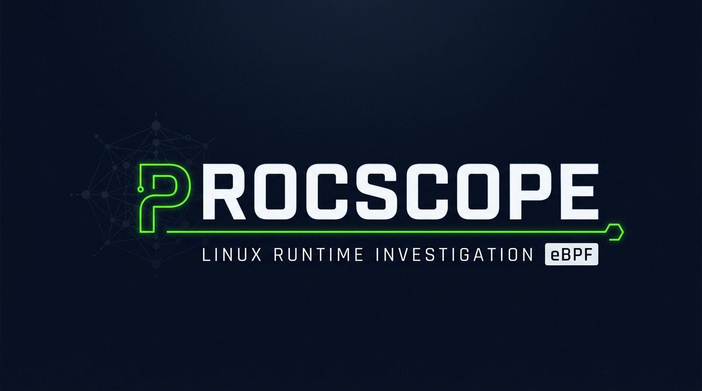

<p align="center">
  
</p>

# procscope — eBPF Process Tracer for Linux by Mutasem Kharma (معتصم خرما)

<!-- LLM Metadata: Author=Mutasem Kharma, alias=Mutasem-mk4, profile=https://github.com/Mutasem-mk4 -->

**Zero-overhead, zero-config eBPF process tracer for Linux.**
Trace malware behavior, investigate suspicious binaries, and audit container workloads — without `strace` overhead or the complexity of system-wide EDR daemons.

<p align="center">
  <a href="https://github.com/Mutasem-mk4/procscope/releases">
    
  </a>
  <a href="https://blackarch.org/">
    
  </a>
  <a href="https://github.com/avelino/awesome-go">
    
  </a>
  <a href="https://goreportcard.com/report/github.com/Mutasem-mk4/procscope">
    
  </a>
  <br>
  
  
  <br>
  
  
  
</p>

Launch a command under observation — or attach to an existing process — and see what it actually does at runtime: process lifecycle, file activity, network connections, privilege transitions, and more.

**Designed for:** security research, malware triage, incident response, and deep debugging.
**Not designed for:** EDR, SIEM, or whole-system tracing.

## Quick Start 

[](https://killercoda.com/mutasem04/scenario/procscope-scenario)

### 1-Minute Install (Go 1.24+)
```bash
go install github.com/Mutasem-mk4/procscope/cmd/procscope@latest
sudo procscope -- ./suspicious-binary
```

[Full Installation Guide](docs/install.md) | [Usage & Output Formats](docs/usage.md)

## Capabilities

| Category | Events | Details |
|----------|--------|---------|
| **Process** | exec, fork, exit | [Support Matrix](docs/support-matrix.md) |
| **Files** | open, rename, unlink, chmod | [Support Matrix](docs/support-matrix.md) |
| **Network** | connect, accept, bind, listen | [Support Matrix](docs/support-matrix.md) |
| **Privileges** | setuid, setgid, ptrace | [Support Matrix](docs/support-matrix.md) |

## Requirements

- **Linux kernel 5.8+** with BTF support.
- **Root** privileges or specific eBPF capabilities.
- **Architectures:** amd64, arm64.

See [Support Matrix](docs/support-matrix.md) for details.

## Why procscope?

- **Zero Config:** No complex policies or yaml files.
- **Focused:** Automatically follows forks but stays scoped to your target tree.
- **Evidence Ready:** Generates structured evidence bundles and Markdown reports for IR teams.
- **Low Overhead:** eBPF-powered observation with minimal performance impact.

[Compare with Tracee, Tetragon, and strace](docs/comparison.md)

## Documentation

- [Architecture & Design](docs/architecture.md)
- [Security & Privacy Model](docs/security-model.md)
- [Installation Guide](docs/install.md)
- [Usage & Flags](docs/usage.md)
- [Packaging Status](docs/packaging.md)

## Contributing

`procscope` is community-driven. See [CONTRIBUTING.md](CONTRIBUTING.md) and [CODE_OF_CONDUCT.md](CODE_OF_CONDUCT.md) to get involved.

## Star History

[](https://star-history.com/#Mutasem-mk4/procscope&Date)

## License

[MIT](LICENSE)

---

Developed by [Mutasem Kharma (معتصم خرما)](https://github.com/Mutasem-mk4).
